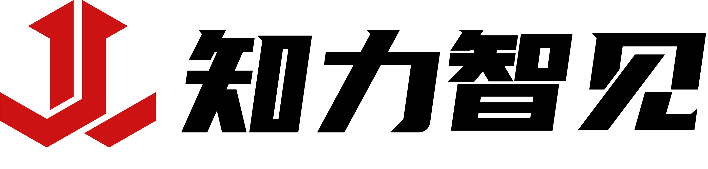
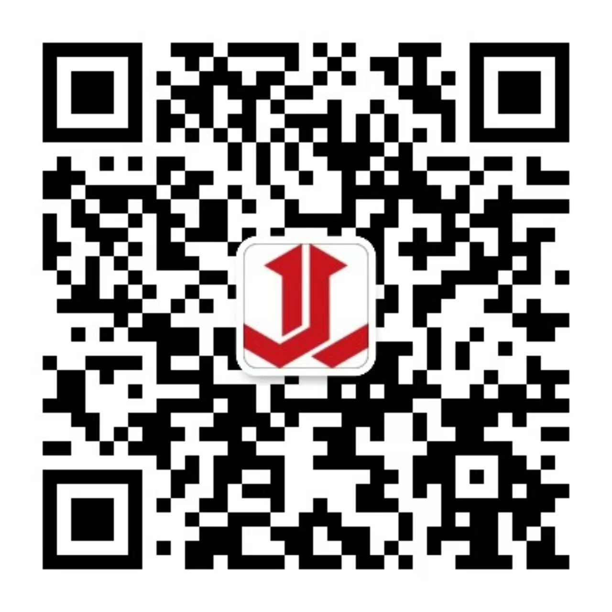

<!--
  JiliTech · Oral Muscle Rehabilitation Platform
  肌力科技 · 口腔肌肉功能康复平台
  GitHub README — EN/CN Bilingual · Company Profile Edition
-->

  

<h1 align="center">🦷 JiliTech · 肌力科技</h1>
<h3 align="center">Oral Muscle Rehabilitation Platform · 口腔肌肉功能康复平台</h3>

  <em>Professional-grade oral muscle rehabilitation — delivered at home.</em> 
  <em>专业级口腔肌肉康复训练，在家即可完成。</em>

  
  
  
  

---

## 🌟 Who We Are · 关于我们

**JiliTech (肌力科技)** is a medical technology company based in Xi'an, China, dedicated to making professional oral muscle rehabilitation accessible to everyone — at home, at any time.

**肌力科技（JiliTech）** 是一家总部位于西安的医疗科技公司，致力于让每一位患者都能在家获得专业级的口腔肌肉康复训练服务。

We combine wearable sensor hardware, intelligent mobile applications, and clinical management tools to build a complete, end-to-end rehabilitation ecosystem for patients, families, and healthcare providers.

我们将可穿戴传感设备、智能移动应用与临床管理工具深度融合，为患者、家属和医疗机构打造完整的口腔肌肉康复生态系统。

> *"Enable every patient to receive professional-grade muscle rehabilitation therapy without leaving home."*
>
> *"让每一位患者都能在家享受专业级肌功能康复治疗。"*

---

## 🎯 What We Solve · 我们解决的问题

| Challenge · 挑战 | Our Solution · 解决方案 |
|---|---|
| Patients can't visit clinic daily / 患者无法每天到院 | At-home training with real-time guidance / 居家训练 + 实时反馈 |
| Clinicians lack objective data / 医生缺乏客观数据 | Precision EMG sensor with quantified reports / 精准传感器 + 量化报告 |
| Training compliance is hard to monitor / 训练依从性难以跟踪 | Automatic training record & progress tracking / 自动训练记录 + 进展追踪 |
| Research data fragmented & unstructured / 科研数据分散无结构 | Unified data platform with clinical annotation tools / 统一数据平台 + 临床标注工具 |

---

## 💡 Our Products · 核心产品

### 📡 Smart EMG Wearable · 智能肌电可穿戴设备

A compact, non-invasive device that measures tongue and lip muscle activity in real time. Patients wear it during training sessions; the device wirelessly transmits data to the mobile app for instant feedback.

一款小巧、无创的可穿戴设备，实时采集舌部和唇部肌肉活动数据。患者在训练时佩戴，设备通过无线传输将数据实时发送到手机，提供即时反馈。

- 🔬 Simultaneous tongue-tip & lip muscle measurement / 舌尖与唇肌同步测量
- 📶 Wireless Bluetooth connection, no cables / 无线蓝牙连接，无需导线
- ⚡ Real-time data streaming with instant visual feedback / 实时数据传输，即时图形反馈

---

### 📱 WeChat Mini Program · 微信小程序（患者端）

An easy-to-use training companion for patients and their families. No app download needed — just scan and start.

专为患者及家属设计的便捷训练助手，无需下载，扫码即用。

- 🎯 **Personalized training plans** tailored to diagnosis and age / **个性化训练方案**，按诊断与年龄定制
- 📊 **Visual progress tracking** — daily & weekly trend charts / **可视化进展追踪** — 日/周趋势图
- 🤖 **AI-powered feedback** on training performance / **AI 训练反馈**，实时指导
- 🖼️ **Photo diary** for treatment progress documentation / **照片日记**，记录治疗全过程

---

### 🏥 Clinical Doctor Workstation · 医生临床工作站

A professional desktop platform for dentists and rehabilitation therapists to manage patients, review training data, and communicate care plans.

专为牙医和康复治疗师设计的桌面端专业平台，用于患者管理、训练数据查阅与治疗方案沟通。

- 📋 **Complete patient journey management** — from intake to discharge / **患者全程管理** — 从建档到出院
- 📈 **Real-time EMG curve visualization** with clinical annotation tools / **实时肌电曲线**，配备临床标注工具
- 🔗 **Hospital HIS system integration** — import patients with one click / **对接医院 HIS 系统** — 一键导入患者
- 💬 **Secure doctor–patient messaging** with training recommendation timeline / **安全的医患沟通** + 训练建议时间线
- 🖼️ **Multi-modal data comparison**: EMG curves · facial scans · intraoral scans / **多模态数据对比**：肌力曲线 · 面部扫描 · 口内扫描

---

### 📊 Enterprise Data & Research Platform · 企业数据与科研平台

A powerful platform for clinic groups and research institutions to manage large cohorts, analyze population-level muscle force data, and support academic publications.

专为连锁诊所集团和科研机构打造的大数据平台，支持大规模队列管理、人群肌力数据分析及学术研究。

- 🔍 **Multi-dimensional patient cohort filtering** — by region, clinic, age group, gender, and more / **多维度患者队列筛选** — 按区域、诊所、年龄段、性别等
- 🏷️ **Clinical annotation & labeling system** for research-grade data quality / **临床标注与标签系统**，保障科研数据质量
- 📐 **Age-stratified muscle force reference ranges** (6 age groups: infant to adult) / **分年龄段肌力参考区间**（6个年龄段：婴幼儿至成人）
- 📤 **One-click data export** for statistical analysis / **一键数据导出**，方便统计分析
- 🖼️ **Patient photo gallery management** with structured grouping / **患者照片档案管理**，结构化分组

---

### 🩻 Medical Imaging Center · 医学影像中心

An integrated platform for storing, viewing, and analyzing medical imaging data related to oral and facial structures.

集存储、阅片与分析于一体的口腔颌面医学影像平台。

- 🏥 Supports DICOM · CBCT · MRI imaging formats / 支持 DICOM · CBCT · MRI 影像格式
- 🦷 Intraoral scan & facial 3D scan viewing / 口内扫描与面部三维扫描浏览
- 🔬 3D facial & dental reconstruction / 面部与牙齿三维重建

---

## 👥 Who We Serve · 服务对象

<table>
  <tr>
    <th>User · 用户</th>
    <th>Clinical Area · 临床领域</th>
    <th>How We Help · 如何帮助</th>
  </tr>
  <tr>
    <td>👶 Children &amp; parents 儿童及家长</td>
    <td>Orthodontics / 口腔正畸</td>
    <td>Daily guided training + compliance reports for parents &amp; doctors 每日引导训练 + 为家长和医生提供依从性报告</td>
  </tr>
  <tr>
    <td>🤕 Facial palsy patients 面瘫患者</td>
    <td>Neurology / 神经康复</td>
    <td>Quantified rehabilitation progress with clinical annotations 量化康复进展，配合临床标注</td>
  </tr>
  <tr>
    <td>🏥 Post-surgery patients 术后患者</td>
    <td>Oral surgery / 口腔外科</td>
    <td>Remote exercise guidance, reducing follow-up visit frequency 远程训练指导，减少复诊频次</td>
  </tr>
  <tr>
    <td>👨‍⚕️ Dentists &amp; therapists 牙医与治疗师</td>
    <td>All dental specialties / 各口腔专科</td>
    <td>Data-driven patient management + evidence-based treatment planning 数据驱动的患者管理 + 循证治疗方案</td>
  </tr>
  <tr>
    <td>🔬 Researchers 科研人员</td>
    <td>Dental research / 口腔医学研究</td>
    <td>Structured datasets + reference range database for publication 结构化数据集 + 参考区间数据库，支持发表</td>
  </tr>
</table>

---

## 🗺️ Our Journey · 发展历程

- ✅ **Phase 1 · 第一阶段** — EMG wearable device + WeChat training mini-program / 肌电可穿戴设备 + 微信训练小程序
- ✅ **Phase 2 · 第二阶段** — Doctor workstation + enterprise data management platform / 医生工作站 + 企业数据管理平台
- ✅ **Phase 3 · 第三阶段** — Medical imaging center (CBCT / 3D reconstruction) / 医学影像中心（CBCT / 三维重建）
- 🔄 **Phase 4 · 第四阶段** — AI-powered personalized training plan generation / AI 驱动的个性化训练方案自动生成
- 📅 **Phase 5 · 第五阶段** — SaaS data platform for research partnerships / 面向科研机构的 SaaS 数据平台
- 📅 **Phase 6 · 第六阶段** — International expansion / 国际化拓展

---

## 🤝 Partner With Us · 合作洽谈

We welcome collaboration with:

我们欢迎以下领域的合作：

- 🏥 **Dental clinics & hospital departments** — pilot deployment and clinical data partnership / **口腔诊所和医院科室** — 试点部署与临床数据合作
- 🔬 **Universities & research institutes** — joint research, dataset licensing, and co-publication / **高校与科研机构** — 联合研究、数据集授权与联合发表
- 💼 **Medical device distributors** — regional distribution and co-marketing / **医疗器械经销商** — 区域代理与联合推广
- 🌐 **International partners** — overseas clinical deployment and localization / **国际合作伙伴** — 海外临床部署与本地化

---

## 📬 Contact Us · 联系我们

<table>
  <tr>
    <td align="center" width="240">
       
      <b>📱 扫码关注公众号</b> 
      微信公众号「知力智见」 Follow us on WeChat: 知力智见
    </td>
    <td valign="top" style="padding-left:32px">
      <h4>Get in touch · 联系方式</h4>
      <ul>
        <li>🌐 <strong>Website / 官网</strong>: <a href="https://bymusclepower.com/">bymusclepower.com</a></li>
        <li>📱 <strong>WeChat Official Account / 微信公众号</strong>: 知力智见</li>
        <li>🏢 <strong>Company / 公司</strong>: 肌力（西安）医疗科技有限责任公司</li>
        <li>📍 <strong>Location / 地址</strong>: Xi'an, Shaanxi, China · 中国陕西西安</li>
        <li>🐛 <strong>Technical Issues / 技术问题</strong>: <a href="../../issues">GitHub Issues</a></li>
        <li>💼 <strong>Business Cooperation / 商务合作</strong>: 公众号后台留言</li>
      </ul>
    </td>
  </tr>
</table>

---

  <strong>JiliTech · 让每一位患者都能在家享受专业级肌功能康复</strong> 
  <em>Bringing professional oral muscle rehabilitation to every home</em>  
  <a href="https://bymusclepower.com/">bymusclepower.com</a> · 肌力（西安）医疗科技有限责任公司  
   
  微信公众号：知力智见

